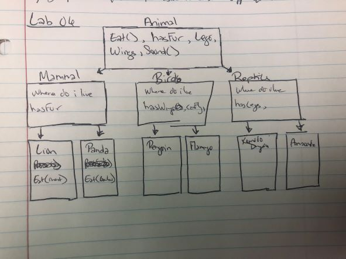
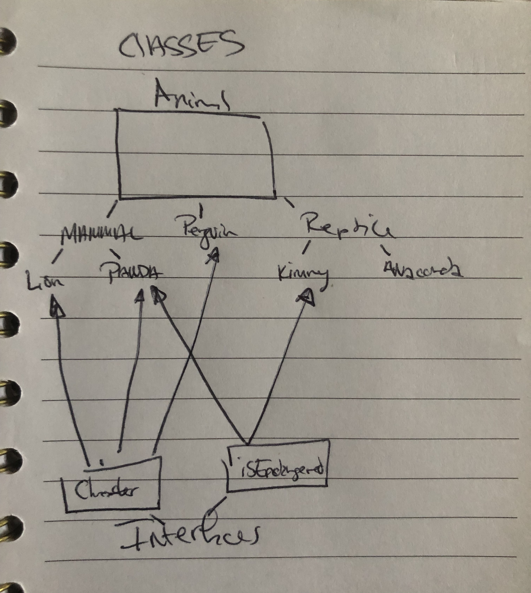

# Lab06_07_OOP_Principles

This lab will be completed in 2 parts:

- Lab 06
- Lab 07

## Introduction

This project is my lab06, and future lab07 homework assignment for Code 401. It is meant to further strengthen my understanding of Object Oriented Programming in C#. It will be a deeper dive into the pillars of OOP in C#: abstraction, encapsulation, inheritance, and polymorphism.

## UML Drawing



## Create your own technical documentation

For this lab, I'm mostly using classes and diving into inheritance and abstraction. I created an Animal class, from which all my other classes are derived from. The Mammal, Reptile, and Penguin classes are all children classes of Animal, with Kimodo, Anaconda, Panda, and Lion classes being "grandchild" classes. With Mammal, Penguin, and Reptile being children of Animal, they're able to have all of the methods/properties belonging to Animal, as well as additional properties specific to them.

I wanted to play around with namespaces and class locations, which is why I have to many separate files. I realize now, after experimentation, I definitely could've put all of my classes in one file, but where's the fun in that?

## Breakdown and define each of the OOP principles in your own words

- Abstraction: templating classes and the methods/properties of that class. Sort of like data modeling with schemas and models in MongoDB/Mongoose
  - ex: creating Animal class with properties and methods applicable to real world animals, with the specificity coming in the further down the class chain. Creating a generic animal the way I wanted to
  - abstraction is apparently used for hiding unwanted data and giving only relevant data
- Inheritance: essentially extending classes in Javascript
  - ex: Penguin class inheriting all methods/properties of Animal parent class
- Polymorphism: using inherited methods/properties to perform different tasks
  - ex: Kimodo class inheriting Reptile class's Name property, and overriding it to create a class constructor
- Encapsulation: hiding data/info not necessary to the user
  - ex: data in Animal class is only accessible to child classes, can only set variables declared in Animal class through getter/setter
    -encapsulation is apparently lets a group of properties and methods be considered a single object
  - wrapping the data into a single unit
  - data in a class is hidden from other classes
  - data hiding
  - can be done by setting classes as private and only getting/setting its values with getters/setters

## Lab 7 Update

### Describe what your interfaces are, where are they being implemented, and why- Provide Examples

- I created a character interface as well as an endangered interface. They're both very simple, only having 2-3 properties.
  - My Character interface is being implemented in the Lion, Panda, and Penguin classes. I chose to implement them there because when I think of those animals, I think of animated movies where those animals have been portrayed; "Madagascar", "Kung Fu Panda", etc. And thought it would be fun to include.
  - I updated the constructor methods in all three classes to include what movie the animal is from and a favorite quote that character says.
    - ex:

```cs

      Penguin skipper = new Penguin("Madagascar", "Kowalski! Go", "Skipper", "sushi");
      skipper.CharacterIntro();
      // would print "Hey, I'm Skipper the penguin from Madagascar."

```

- my Endangerd interface is a bit more fun: i declared a couple of methods as well as an integer.
  - I implemented my Endangered interface in both my Kimodo Dragon class as well as my Panda Class(Panda class got to implement both Character and Endangered interfaces)
  - ex:

```cs

    KimodoDragon kimmy = new KimodoDragon("kimmy", "meat");
    kimmy.whyEndangered();
    // returns 
    // Because humans keep destroying my home!!!

    kimmy.eyesOfTheAngel();
    // returns "*sarah mclaughlin singing*
    //In the eeeeyes offf the AaAaangel...Hi, I'm Sarah McLaughlin and for just $15 dollars an hour, you can help save this endangered species...

```

### Updated diagram with your interfaces mapped out

